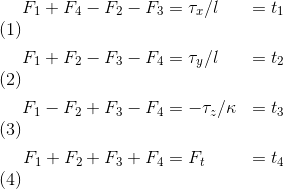
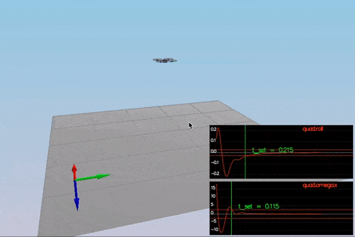
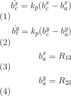
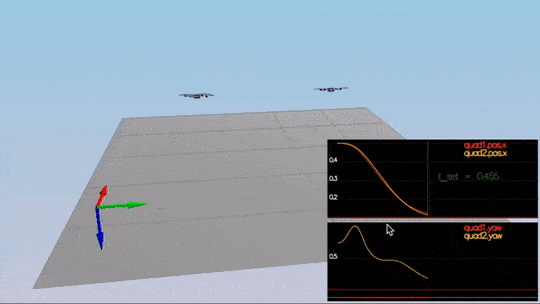
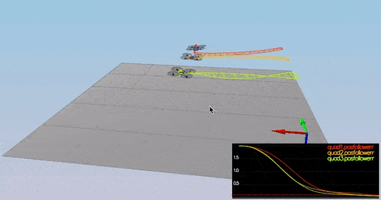

# FCND-Term1-P3-3D-Quadrotor-Controller
Udacity Flying Car Nanodegree - Term 1 - Project 3 - 3D Quadrotor Controller

In this project, you get to implement and tune a [cascade PID controller](https://controlstation.com/cascade-control-cascade-control-configured/) for drone trajectory tracking. The theory behind the controller design using feed-forward strategy is explained in details on our instructor, [Angela P. Schoellig](http://www.dynsyslab.org/prof-angela-schoellig/), on her paper [Feed-Forward Parameter Identification for Precise Periodic
Quadrocopter Motions](http://www.dynsyslab.org/wp-content/papercite-data/pdf/schoellig-acc12.pdf). The following diagram could be found on that paper describing the cascaded control loops of the trajectory-following controller:


# Project description

There two parts for this project where the controller needs to be implemented with python on the first one, and with c++ in the second one.


## C++ implementation

This is the more complicated part of the project. If the parameter tuning on the python part was hard, this part is ten times harder. The C++ part is just a detail on this onerous task. In this case, the simulator is enforced more real limits to the implementation, and things can go wrong when some of those limits are not implemented correctly. More interesting than that is when things are not entirely wrong, just a bit. Udacity also provides a [seed project](https://github.com/udacity/FCND-Controls-CPP) with the simulator implementation and placeholders for the controller code. The seed project README.md give guides to run the project and information of the task we need to execute for implementing the controller. There are five scenarios we need to cover. The simulator runs in a loop on the current scenario and show on the standard output an indication the scenario pass or not.

- [/config/QuadControlParams.txt](./config/QuadControlParams.txt): This file contains the configuration for the controller. While the simulator is running, you can modify this file, and the simulator will "refresh" those parameters on the next loop execution.
- [/src/QuadControl.cpp](./src/QuadControl.cpp): This is where all the fun is, but I should not say this because this file contains the implementation of the controller only. Most of the time needed to pass the scenarios is spend on the parameter tuning.

### Prerequisites

Nothing extra needs to install but the IDE is necessary to compile the code. In my case XCode because I am using a Macbook. Please, follow the instructions on the [seed project README.md](https://github.com/udacity/FCND-Controls-CPP).

### Run the code

Following the instruction on the seed project, load the project on the IDE.

### Scenario 1: Intro

In this scenario, we adjust the mass of the drone in [/config/QuadControlParams.txt](./config/QuadControlParams.txt) until it hovers for a bit:


### Scenario 2: Body rate and roll/pitch control
#### Implemented body rate control in C++

The commanded moments are calculated in the body
rate control is implemented as proportional control
in [/src/Quad Control::BodyRateControl] method. There is no constant MAX_TORQUE provided so the following is performed 
```
momentum = I * kpPQR * p_term;
```
Where all the `F_1` to `F_4` are the motor's thrust, `tao(x,y,z)` are the moments on each direction, `F_t` is the total thrust, kappa is the drag/thrust ratio and `l` is the drone arm length over square root of two. These equations come from the classroom lectures. There are a couple of things to consider. For example, on NED coordinates the `z` axis is inverted that is why the moment on `z` was inverted here. Another observation while implementing this is that `F_3` and `F_4` are switched, e.g. `F_3` in the lectures is `F_4` on the simulator and the same for `F_4`.

At this point, the `kpPQR` parameter has to be tuned to stop the drone from flipping, but first, some thrust needs to be commanded in the altitude control because we don't have thrust commanded on the `GenerateMotorCommands` anymore. A good value is `thurst = mass * CONST_GRAVITY`.


#### Implemented roll pitch control in C++

The controller should use the acceleration and thrust commands, in addition to the vehicle attitude to output a body rate command. The controller should account for the non-linear transformation from local accelerations to body rates. Note that the drone's mass should be accounted for when calculating the target angles.
The roll pitch control is implemented in [src/QuadControl::RollPitchControl]
Rotation Matrix is the mechanism for changing the representation of vector in one(Body ) frame to
representation in another (World or Inertial)frame. 


But the problem is you need to output roll and pitch rates; so, there is another equation to apply:


It is important to notice you received thrust and thrust it need to be inverted and converted to acceleration before applying the equations. After the implementation is done, start tuning `kpBank` and `kpPQR`(again? yes, and it is not the last time) until the drone flies more or less stable upward:
The thrust, mass of the Quad, acceleration, Kp Gains for
pitch and roll and rotation matrix are put in for solving
equation to get desired pitch rate and roll rate commands.

### Scenario 3: Position/velocity and yaw angle control

#### Implement altitude controller in C++.
The controller should use both the down position and the down velocity to command thrust. Ensure that the output value is indeed thrust (the drone's mass needs to be accounted for) and that the thrust includes the non- linear effects from non-zero roll/pitch angles.
The altitude control is implemented in [/src/QuadControl::AltitudeControl method from]
* Find Altitude error
* Mutlipy by kp_gain_Alt and add velocitycmd
* Then margin ascending and descending rate.
* Calculate acceleration by drone mass,feedforward and integration error
* Normalise acceleration by rotation matrix [2,2] the Negativity of Gravity is used for Normalization.
* Margin the thrust
#### Implement lateral position control in C++
The lateral position control is implemented in [/src/QuadControl::LateralPositionControl] method
* Using Postion err, velocity err and get velocity command by product of postion gain.
* Normalize velocity command by Euclidean distance.
* Norm Velocity is limited by max speed.
* Calculate local Acceleration by above all variables with kp gains.
* Normalized Euclidean Acceleration is limited bymaxAccelXY. This one took from slack student help. 
#### Implement yaw control in C++.
The yaw control is implemented in [/src/QuadControl::YawControl] method
* Set Margin the angle from 0 to 2Pi
* Using fmodf function
####  Implement calculating the motor  moments in C++.
commands given commanded thrust and
This is from slack inputs and my mentor helped me to
solve this equation.
```
F_tot = F0 + F1 + F2 + F3
l = L / sqrt (2) // half the distance between rotors
tau_x = (F0 - F1 + F2 - F3) * l // This is Roll
tau_y = (F0 + F1 - F2 - F3) * l // This is Pitch
tau_z = (-F0 + F1 + F2 - F3) * kappa // This is Yaw
kappa = kf/km //coefficient gains
```
Now we have 4 equations and 4 unknowns (the F
values), so we can solve them to get the F1, F2, F3 and
F4 values, given that we already know the F_tot, tau_x,
tau_y and tau_z inputs to the GenerateMotorCommands function.
 

#### Scenario 4: Non-idealities and robustness

This is a fun scenario. Everything is coded and tuned already, right? Ok, we need to add an integral part to the altitude controller to move it from PD to PID controller. What happens to me here is that everything starts not working correctly, and I have to tune everything again, starting from scenario -1. Remember patience is a "virtue", and to it again. If you cannot and get frustrated talk to your peers, they will be able to give you hints. It is hard but doable:



#### Scenario 5: Tracking trajectories

This is the final non-optional scenario. The drone needs to follow a trajectory. It will show all the errors in your code and also force you to tune some parameters again. Remember there are comments on the controller methods regarding limits that need to be imposed on the system. Here those limits are required in order to pass.


